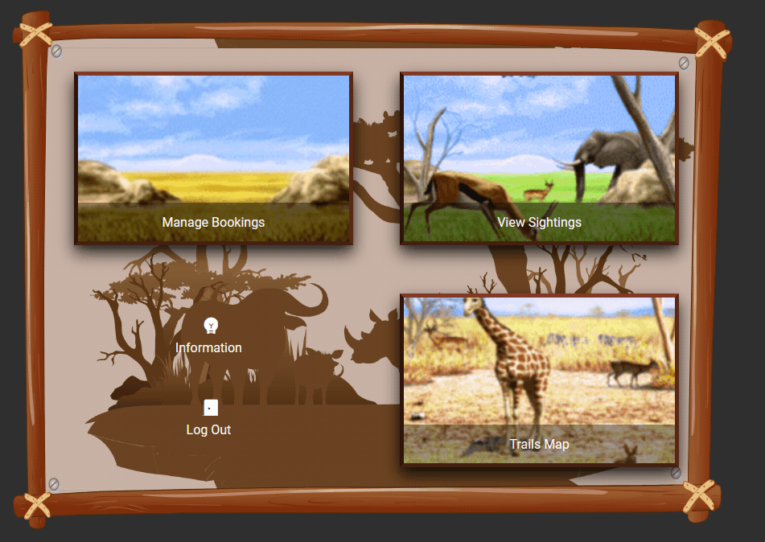
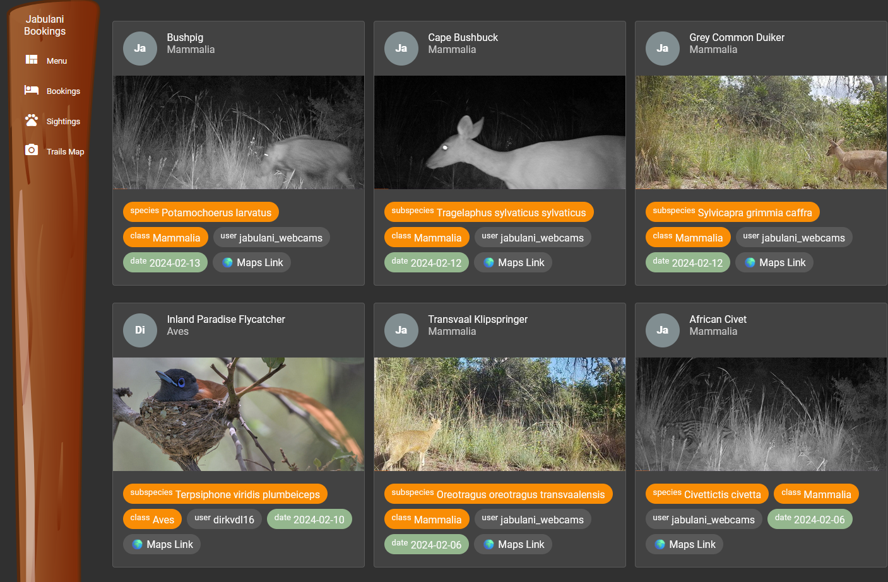

# SimsafariLodgeBooking

A Web App to, among others, manage bookings for our small family land

## Features

- The ultimate PC game from my childhood, a [SimSafari](https://en.wikipedia.org/wiki/SimSafari) Look and Feel



- iNaturalist integration



- Payfast (Payment Gateway) Integration - *yes we charge the family fees, but it all goes back into maintaining the property*
- Telegram notification on Log-in events - *you know, to check if your family actually uses the thing you have built* :) 


## Deployment

A commit to `main` will trigger a Github Action that builds the artefacts and deploy it to an AWS S3 Bucket. See the [simsafari-lodge-booking-infra](https://github.com/dvdl16/simsafari-lodge-booking-infra) repo for the infrastrictire.

## Development server

Run `ng serve` for a dev server. Navigate to `http://localhost:4200/`. The application will automatically reload if you change any of the source files.

## Build

Run `ng build` to build the project. The build artifacts will be stored in the `dist/` directory.

## Manual Deployment

```bash
# Build the artefacts
ng build --configuration=production

# Set AWS profile to use
export AWS_PROFILE=[AWS PROFILE NAME]

# Upload artefacts to S3
cd dist/simsafari-lodge-booking && cp index.html 404.html
aws s3 sync . s3://www.[DOMAIN NAME]

# Invalidate Cloudfront cache
AWS_DISTRIBUTIONS=$(aws cloudfront list-distributions)
AWS_DISTRIBUTION_ID=$( echo $AWS_DISTRIBUTIONS | jq -r '.DistributionList.Items | map(select(any(.Aliases.Items[]; contains("www.[DOMAIN NAME]")))|.Id)[]')
aws cloudfront create-invalidation --distribution-id $AWS_DISTRIBUTION_ID --paths "/*";
```

## Update

To [update](https://update.angular.io/) your workspace and its dependencies:

```shell
ng update
```